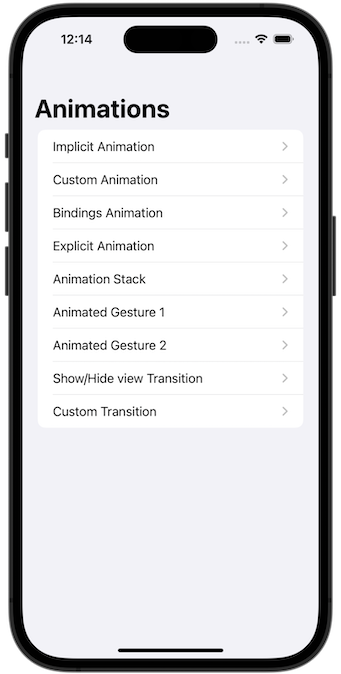
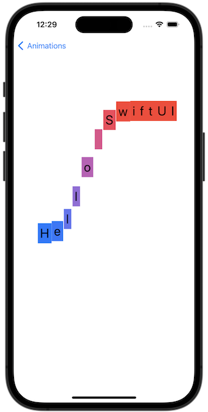
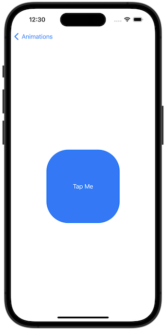
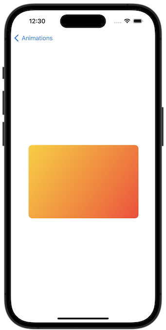

# Project 6 - Animations

https://www.hackingwithswift.com/100/swiftui/32

## Topics

Animations and transitions

## Challenges

From [Hacking with Swift](https://www.hackingwithswift.com/books/ios-swiftui/animation-wrap-up):

> Go back to the Guess the Flag project and add some animation:
>
> 1.  When you tap a flag, make it spin around 360 degrees on the Y axis.
> 2.  Make the other two buttons fade out to 25% opacity.
> 3.  Add a third effect of your choosing to the two flags the user didn’t choose – maybe make them scale down? Or flip in a different direction? Experiment!

## Screenshots

